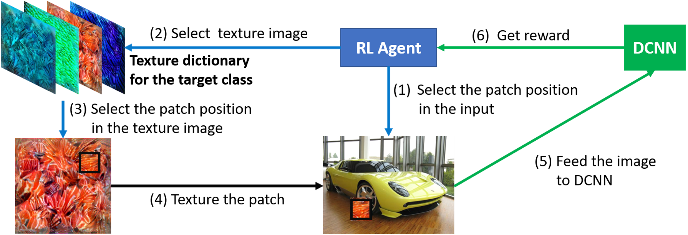

# ReinforceAttack

## Project Metadata
### Authors
- **Team:** Ahmed Abdelkader Ahmed
- **Supervisor Name:** Dr. Muzammil Behzad
- **Affiliations:** KFUPM

## Introduction
Patch attacks modify only a small, localized region of an image yet can force a victim model to misclassify—either toward a specific target label or away from the ground-truth label. This paper introduces PatchAttack, a query-efficient black-box method that learns both where to place patches and what they should look like. The attack can be modeled as a reinforcement-learning (RL) problem: an agent chooses a patch (either a monochrome patch or a crop from a learned texture dictionary) and its location (the action space), queries the victim model (the environment) with the patched image, receives a reward based on the model’s output probabilities, and updates its policy to optimize next actions. Figure 1 illustrates this loop.


*Figure 1.* Black-box texture-based patch attack. Source: [arXiv:2004.05682](https://arxiv.org/pdf/2004.05682).


On ImageNet models (ResNet, DenseNet, ResNeXt, MobileNetV2), PatchAttack’s textured variant (TPA) reduces top-1 accuracy to <1% with only ~3% of pixels modified and ~10³ queries in the non-targeted case, and achieves ≈100% target-label accuracy while modifying on the order of 10% of the image. Beyond raw success rate, it is markedly more query-efficient than Metropolis–Hastings patch search and remains effective against defenses such as Feature Denoising (Denoise-ResNet152) and shape-biased networks trained on Stylized-ImageNet.


## Problem Statement
The problem is to cause a classifier to err using **only query access** by altering a **small, localized** image region.

#### Mathematical Modeling
Let $f(x;\theta)$ be a deep neural network, where $x$ is the input image and $\theta$ are model parameters. An adversarial example is obtained by applying a transformation $g(\cdot)$ to $x$ and optimizing a loss $L(y, y_0)$ with $y = f(g(x);\theta)$; here $y_0$ denotes a target class and $y$ the ground-truth label. In **targeted** attacks, the objective is to increase the score for $y_0$; in **non-targeted** attacks, the objective is to induce misclassification.

For **patch-based** attacks, the modification is restricted to a small region $E \subseteq \{(u,v)\mid u \in [0,H),\, v \in [0,W)\}$. Pixels inside $E$ are transformed by $T(\cdot)$ while others remain unchanged:

$$
x_{u,v} =
\begin{cases}
T(x_{u,v}), & (u,v)\in E,\\
x_{u,v}, & \text{otherwise.}
\end{cases}
$$

The region $E$ is selected by a search mechanism $s(\cdot)$ over a candidate space $S$ and may depend on the specific image $x$ and network $f$. $H,W$ denote image height and width; $(u,v)$ are pixel coordinates.

**Research question:** Given only model outputs, can a compact, localized modification—specified by $E$ and $T$—reliably induce targeted or non-targeted misclassification while respecting small-area and practical query budgets?


## Application Area and Project Domain
This project lies in the domain of adversarial machine learning for computer vision, with a focus on secure and reliable systems through robustness evaluation and attack optimization. It addresses localized, physically realizable black-box patch attacks under a query-only threat model (no access to gradients or parameters), which mirrors how models are commonly deployed in practice—via APIs, embedded devices, or third-party services—making the setting closer to real-world conditions than traditional white-box assumptions. The work formulates patch attacks as a constrained search problem over patch placement and appearance, bounded by patch size and query budgets, and connects directly to practical applications such as surveillance cameras, traffic-sign recognition in autonomous driving, and face-recognition access control systems.


## What is the paper trying to do, and what are you planning to do?
We revisit **PatchAttack** a query-efficient, black-box adversarial patch framework that learns both where to place a patch and what it should look like—and elevate patch geometry to a first-class decision. Building on the textured variant (TPA), we design two targeted, score-based black-box attacks: **ShapeAware**, which adds a shape head (circle/triangle/square) with an area-aware reward to encourage compact, overlapping masks; and **PatchCross**, which specializes the mask to a thin X-shape for strong camouflage while keeping the original targeted reward. Under matched budgets (fixed query limits, up to 𝑁 placements with per-step occlusion), we evaluate on **ImageNet ILSVRC-2012** using ResNet-50 and ViT-B/16, reporting attack success rate (ASR), average number of queries (ANQ), and average patch area (APA).

### Project Documents
- **Presentation:** [Project Presentation](/presentation.pptx)
- **Report:** [Project Report](/Project_report.pdf)

### Reference Papers
- [PatchAttack: A Black-box Texture-based Attack with Reinforcement Learning](https://arxiv.org/pdf/2004.05682). More information can be found at this [GitHub repository.](https://github.com/Chenglin-Yang/PatchAttack)
- [Cross-Shaped Adversarial Patch Attack](https://ieeexplore.ieee.org/stamp/stamp.jsp?tp=&arnumber=10225573). More information can be found at this [GitHub repository.](https://github.com/GZHU-DVL/CSPA/tree/main)
  

### Reference Dataset
The texture dictionary (published by the PatchAttack authors) is provided in the following two parts, and Images Test_set is the image group we used for evaluation and comparison.
- [TextureDict_ImageNet_0.zip](https://livejohnshopkins-my.sharepoint.com/personal/cyang76_jh_edu/_layouts/15/onedrive.aspx?id=%2Fpersonal%2Fcyang76%5Fjh%5Fedu%2FDocuments%2FPatchAttack%2FTextureDict%5FImageNet%5F0%2Ezip&parent=%2Fpersonal%2Fcyang76%5Fjh%5Fedu%2FDocuments%2FPatchAttack&ga=1)
- [TextureDict_ImageNet_1.zip](https://livejohnshopkins-my.sharepoint.com/personal/cyang76_jh_edu/_layouts/15/onedrive.aspx?id=%2Fpersonal%2Fcyang76%5Fjh%5Fedu%2FDocuments%2FPatchAttack%2FTextureDict%5FImageNet%5F1%2Ezip&parent=%2Fpersonal%2Fcyang76%5Fjh%5Fedu%2FDocuments%2FPatchAttack&ga=1)
- [Images Test_set](https://drive.google.com/file/d/1a2c4v2KR6OEyHv4PlqcoibOCSQKdG1pp/view?usp=drive_link)


## Project Technicalities

## Terminologies
- **Score-based black-box attack:** Attacker can only **query** the model and read scores/logits; no gradients or internals.
- **PatchAttack (TPA):** RL-based baseline that selects a **texture** from a class-conditioned dictionary and a **placement** for a **fixed square** mask under area limits.
- **Texture Dictionary:** Pre-synthesized, class-conditioned textures (built via VGG-19 style descriptors + Grad-CAM + k-means) from which the agent picks.
- **Union Mask / Occlusion Area:** The combined binary mask from all placed patches; **per-step occlusion** is capped (e.g., 2% of the image).
- **Evaluation Metrics:**
  - **ASR** — Attack Success Rate.
  - **ANQ** — Avg. Number of Queries (report for successes and for all).
  - **APA** — Avg. Patch Area % (report for successes and for all).

## Problem Statements
- **P1: Geometry as a decision variable.** Most black-box patch attacks optimize **texture + location** only; **shape is fixed** (usually square), limiting compactness and realism under tight area/query budgets.
- **P2: Efficiency under strict budgets.** Achieving **high ASR** while **reducing queries (ANQ)** and **union area (APA)** is challenging, especially for **targeted** attacks.
- **P3: Stability of RL search.** Large/naive action spaces and weak rewards can destabilize learning; designing **principled action spaces + rewards** is non-trivial.
- **P4: Transformer sensitivity.** Baselines can degrade on **ViT-B/16**, highlighting a need for **richer geometry or better rewards** to maintain ASR with low ANQ/APA.
- **P5: Comparability.** Mixed reporting protocols across papers (**ASR/ANQ/APA** not consistently split into successes vs. all) hinder fair comparison.


### Proposed Solution: Code-Based Implementation

PyTorch implementation of **score-based black-box adversarial patch attacks** with our geometry-aware variants.

- **ShapeAware (ours):** RL agent picks **texture, location, and shape** (circle/triangle/square) with an **area-aware reward** that encourages compact, overlapping placements.
- **PatchCross (ours):** Ultra-sparse **X-shaped** geometry (two 1-px diagonals) parameterized by anchor points for strong camouflage at tiny visible area.

### Key Components
- **`PatchAttack_config.py`** — `configure_PA(...)` sets budgets and occlusion limits (e.g., `area_occlu=0.02`, `RL_BATCH=200`, `STEPS=20`, `TPA_N_AGENTS=10`).
- **`PatchAttack_attackers.py`** — Core attackers; entry point `TPA.attack(...)` implements the RL-driven placement loop.
- **`PatchAttack_agents.py`** — Agent logic for **PatchAttack**, **ShapeAware**, and **PatchCross** action spaces.
- **`TextureDict_builder.py` / `AdvPatchDict_builder.py`** — Build/load **class-conditioned texture dictionaries**.
- **`utils.py`** — Compositing ops, masks, logging, metrics (ASR/ANQ/APA), and IO.
- **<variant_name>.ipynb`** — Minimal end-to-end example.
  
### Model Workflow
1. **Inputs**
   - **Image `x` (224×224, ImageNet norm)** and **target class `t=723`** (targeted setting).
   - **Budgets:** placements **N≤10**, per-step occlusion **≤2%**, and query caps.
   - **Texture dictionary** loaded for class‑conditioned candidate patches.
2. **Attack Loop**
   - Agent proposes **(texture, location[, shape])** → compose patch → **query victim model** (ResNet‑50 / ViT‑B/16).
   - Compute **reward**; update agent (RL).
   - **Early stop** when the last-3‑step mean log‑reward’s second finite difference **< 1e‑4**.
3. **Outputs & Metrics**
   - Return **adversarial image** within budgets.
   - Report **ASR**, **ANQ** (successes & all), **APA** (successes & all) for fair comparison.


## How to Run the Code

1) **Choose an attack variant**  
   Each variant has its own folder: [ShapeAware](/ShapeAware/) · [PatchCross](/PatchCross/)

2) **Enter the folder**
```bash
# from repo root
cd ShapeAware    # or: cd PatchCross
```

3) **Open the matching notebook**  
   Launch Jupyter and run the notebook for that variant, for example:
- `Shape_aware.ipynb`

> Tip: Run all cells via `jupyter lab` or `jupyter notebook`.

### Ready-to-run Kaggle notebooks (temp links)
- **ShapeAware:** [ShapeAware – Kaggle Notebook](https://www.kaggle.com/code/mangooo999/shapeaware)  
- **PatchCross:** [PatchCross – Kaggle Notebook](https://www.kaggle.com/code/mangooo999/cross-notebook)


## Acknowledgments
- **Open-Source Communities:** Thanks to the contributors of PyTorch, and other libraries for their amazing work.
- **Individuals:** Special thanks to the original authors of PatchAttack and CSPA for their foundational contributions.
- **Resource Providers:** Gratitude to Kaggle organization for providing the computational resources necessary for this project.
